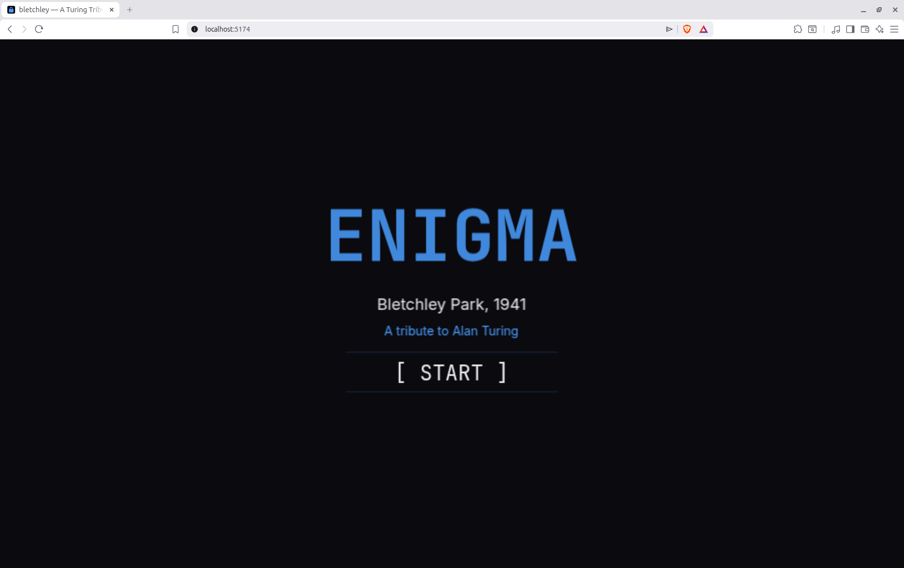

# bletchley — A Turing Tribute



Codebreaking game · June Solstice Game Jam 2026 · Best Ode to Alan Turing

---

You are a codebreaker at Bletchley Park. Decrypt intercepted messages by adjusting Enigma rotors before time runs out.

4 levels · 2 cipher types · historically accurate cribs

## Run locally

```bash
npm install && npm run dev
```

## Stack

Phaser 3 · Vite · Tone.js · Vercel
